<p align="center">
  
</p>

<h1 align="center">🧠 DevInsightAI</h1>

<p align="center">
AI-Powered Code Review Platform for Architecture, Security, Performance & Production Readiness
</p>

---

## 🚀 Overview

DevInsightAI is an AI-powered code review platform that analyzes software repositories and source code to generate deep engineering insights.

It acts like a senior software engineer reviewing your codebase and identifies issues in:

- Architecture
- Security
- Performance
- Database design
- Concurrency
- Production readiness

Users can:
- Analyze GitHub repositories
- Upload ZIP files
- Generate AI-powered engineering reports
- Download and view past reports

---

## ✨ Features

### 🔍 Repository Analysis
- GitHub repository analysis
- ZIP file upload support

### 🧠 AI Code Review Engine
- Executive summary
- Architecture review
- Security assessment
- Authentication review
- Database design review
- Async & concurrency analysis
- Performance analysis
- Production readiness score (0–100)
- Technical debt analysis

### 📁 Report Management
- Save reports
- View history
- Download reports anytime

### 🔐 Authentication
- Email/password login
- Google OAuth
- GitHub OAuth
- Secure sessions
- Welcome email system

---

## 📸 Screenshots

### Landing Page
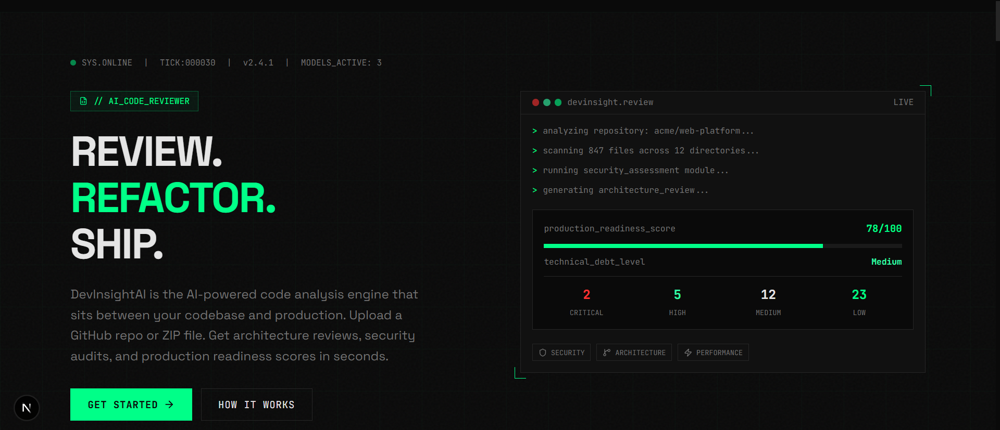

### Signup Page
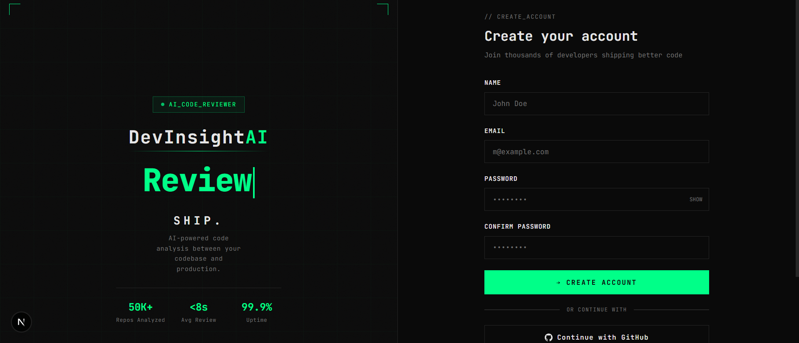

### Login Page
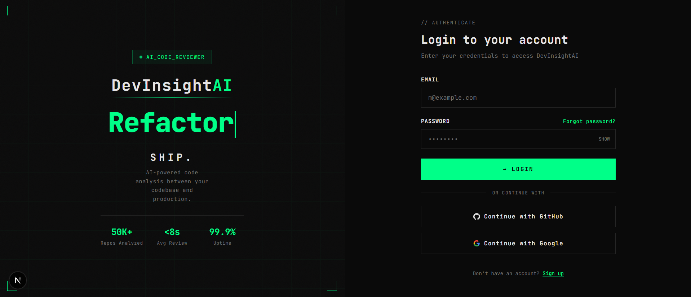

### Dashboard
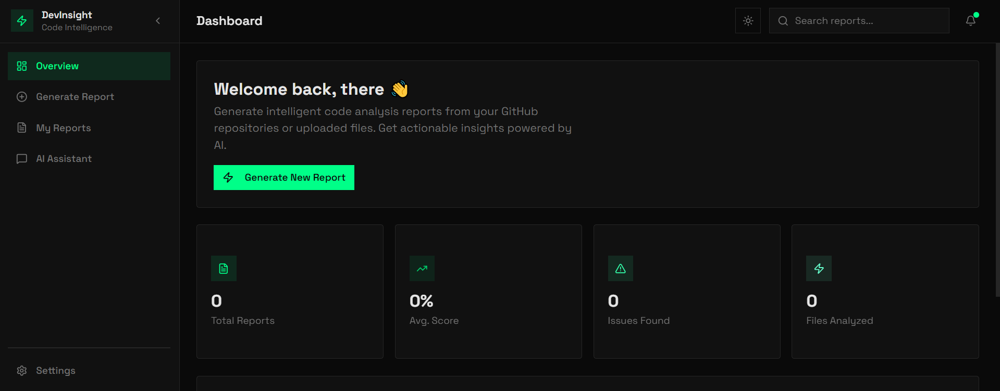

### Create Report Page
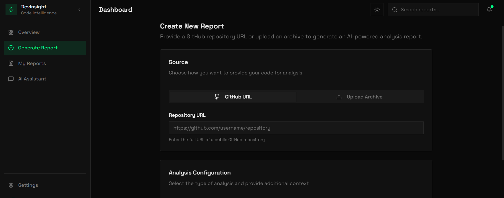

### My Report
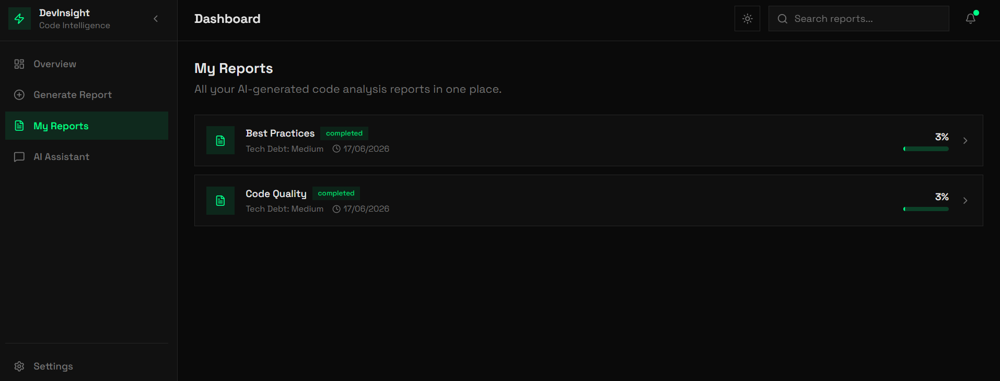

### Report Reviews
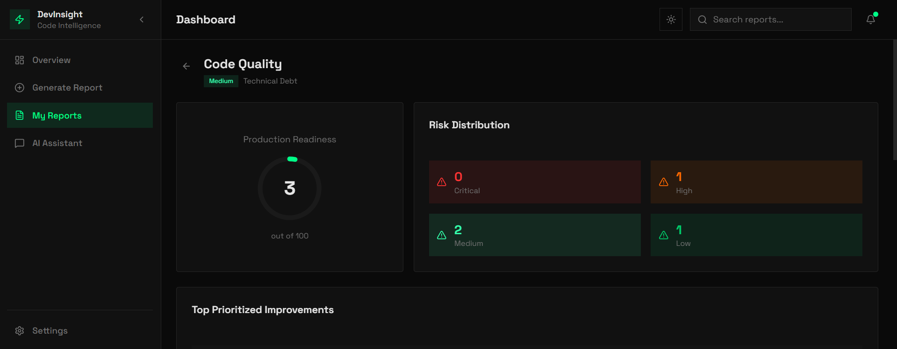
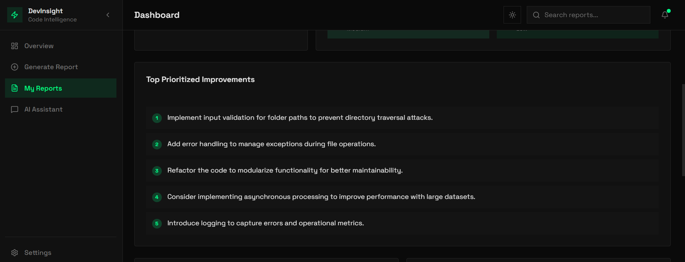
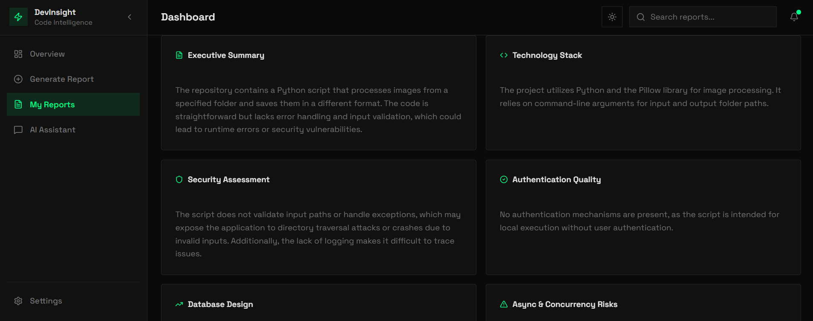
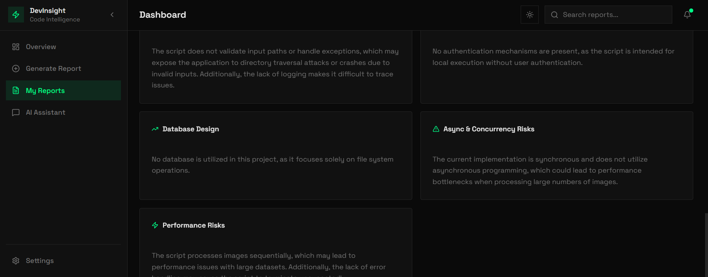

### AI-Assistant
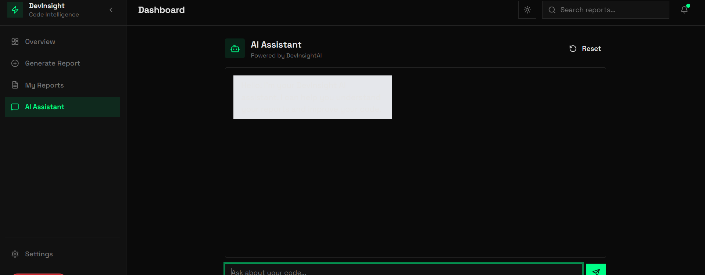

---

## 🏗 Architecture

```mermaid
graph TD
A[Next.js Frontend] --> B[FastAPI Backend]
B --> C[OpenAI API]
B --> D[PostgreSQL]
B --> E[Redis]
B --> F[OAuth Services]
B --> G[SMTP Email Service]

🧰 Tech Stack
Backend
Python
FastAPI
PostgreSQL
Redis
SQLAlchemy Async
Frontend
Next.js
TypeScript
Tailwind CSS
AI & Auth
OpenAI API
GitHub OAuth
Google OAuth
SMTP Email
DevOps
Docker
Docker Compose
🚀 Getting Started
Clone Repository
git clone https://github.com/your-username/devinsightai.git
cd devinsightai
Setup Environment
DATABASE_URL=
REDIS_URL=
OPENAI_API_KEY=
GOOGLE_CLIENT_ID=
GOOGLE_CLIENT_SECRET=
GITHUB_CLIENT_ID=
GITHUB_CLIENT_SECRET=
SMTP_HOST=
SMTP_PORT=
SMTP_USER=
SMTP_PASS=
SECRET_KEY=
Run Project
docker compose up --build
📊 How It Works
User logs in
Selects GitHub repo or uploads ZIP
Backend processes code
AI generates report
User views/downloads results
🎯 Production Score

Each project is analyzed based on:

Architecture quality
Security risks
Performance issues
Database design
Maintainability

Output: 0–100 score

🚧 Roadmap
 GitHub repo analysis
 ZIP file analysis
 AI reports
 Report history
 Team dashboards
 PDF export
 PR review bot
 CI/CD integration
📂 Project Structure
server/
client/
docker-compose.yml/
assets/
README.md
💡 Why DevInsightAI?

DevInsightAI helps developers understand:

What is wrong in their code
What to fix first
How to improve architecture
How production-ready their code is

It acts like a senior engineer reviewing your code instantly.

📜 License

MIT

📫 Contact
LinkedIn: https://www.linkedin.com/in/ibad-ur-rehman-rajput-69554433b/
Email: ahmedibad0012@gmail.com
Portfolio: https://ibadrajputportfolio.netlify.app/

⭐ If you like this project, give it a star!